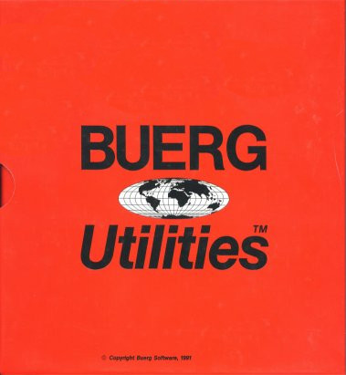

In this repository I collect all published versions of
the shareware DOS utilities developed by Vernon Duncan
Buerg from the 1980s until the mid 2000s. At the time
he was renowned for developing the small and fast
file viewing and browsing utility [LIST](list/VERSIONS.md).

Together with his wife Julie Buerg he ran his
computer software company from Petaluma, CA.
The company
[website](https://web.archive.org/web/20080511172548/http://www.buerg.com/)
has been archived by archive.org

Besides being active on Compuserve
as [CIS:70007,1212](70007.1212@compuserve.com)
and developing AUTOSIG,
Buerg also ran
[VOR BBS](http://bbslist.textfiles.com/707/707.txt)
during the late 1990s for customer
support.

Vernon
[passed](https://www.legacy.com/us/obituaries/pressdemocrat/name/vernon-buerg-obituary?id=15491153)
[away](https://www.legacy.com/us/obituaries/pressdemocrat/name/vernon-buerg-obituary?id=15488919)
in 2009.

## The Buerg Utilities

When the origin of the utility version is known
the commit message adding those files contains
the URL of the origin.

The latest versions are tracked in the table
below, and the version history is available
for each utility.

If you happen to have (a version of) a utility
not present here, please raise an issue and let
me know where to get hold of it, thank you!

Oh, and all utilities have been scanned with the
period correct Thunderbyte Anti-Virus 8.11. :)

| Program | Latest version | Date | Description |
| --- | --- | --- | --- |
| [DELDUPE](deldupe/VERSIONS.md) | 2.3 | 03/01/89 | Delete duplicate file between subdirectories |
| [DRLIST](drlist/VERSIONS.md) | K | 03/06/93 | Special version of LIST for use with CTTY/ANSI |
| [FBR](fbr/VERSIONS.md) | 1.82 | 07/04/92 | File backup/restore utilities. Alternative to BACKUP and RESTORE commands |
| [LDIR](ldir/VERSIONS.md) | 4.4 | 03/25/91 | Display directories in selected file order. Alternative to the DIR command |
| [LIST](list/VERSIONS.md) | 9.6y1 | 06/20/05 | Full screen viewing of files, see LIST.DOC Alternative to the TYPE and MORE commands. Run ARCE MORELIST for rest of LIST files |
| [QDR](qdr/VERSIONS.md) | 4.0c | 07/11/91 | Quick Diskette Reformatter deletes all files. Clean off a disk for re-use |
| [SORTF](sortf/VERSIONS.md) | 2.38 | 10/09/91 | Fast file sorter handles large files. Alternative to the SORT filter |
| [SQPC](sqpc/VERSIONS.md) | 1.31 | 03/02/86 | Fast file squeezer. Creates a compressed copy of a file to save disk space |
| [SWAPNAME](swapname/VERSIONS.md) | 1.2 | 02/20/86 | Switch names of two files, like CONFIG.xxx |
| [TABS](tabs/VERSIONS.md) | 2.1 | 10/14/86 | Replace spaces with TABs and vice versa, in ASCII text files |

### Archiving utilites

| Program | Latest version | Date | Description |
| --- | --- | --- | --- |
| [ARCA](arca/VERSIONS.md) | 1.29 | 12/09/87 | Create or add files to an ARC archive file |
| [ARCE](arce/VERSIONS.md) | 4.1a | 04/12/92 | Extract files from an ARC archive file |
| [ARCF](arcf/VERSIONS.md) | 1.10 | 03/10/92 | Find text strings inside ARC files |
| [ARCV](arcv/VERSIONS.md) | 1.22 | 04/13/91 | Display a list of files in an ARC archive |
| [DUH](duh/VERSIONS.md) | 1.5 | 05/02/89 | Delete files that already exist in archive files |
| FV | 2.00 | 01/11/00 | Display directories of archive files including ARC, PAK, ZIP, LZH and self extracting files |
| LARC | 2.6 | 05/23/90 | Create the Littlest ARChive file, w/BAS |
| LUD | 1.06 | 07/08/85 | Delete one or more files from a library (LBR file) |
| LUE | 2.2 | 04/28/86 | Extract one or more files (members) from an LBR type library |
| LUT | 1.93 | 05/27/85 | Displays the directory of library (LBR) files |
| LUU | 2.13 | 04/28/86 | Add or replace members in an LU or LAR type library |
| LUX | 1.2 | 11/12/84 | Execute a COM or EXE program directly from a LBR type file |
| QBARCV | 1.10 | 08/07/86 | Quick Basic subroutine to display ARC directory |
| XONE | 2.3 | 10/12/87 | Make an ARC file from one or more ARC files |
| ZIPV | 1.08 | 04/19/89 | Display ZIP file directories, w/ASM |

### BASIC programming aids

| Program | Latest version | Date | Description |
| --- | --- | --- | --- |
| CCIT | 1.0 | 09/22/86 | QB subroutine to calculate CCIT CRC for XMODEM includes assembler source |
| FC | 1.3 | 08/17/85 | Produce .MRG file of differences for BASIC files |
| QBX | 4.00g | 10/09/88 | Quick Basic program lister, label/symbol cross referencer |
| RB | 1.58 | 08/20/85 | Convert token BASIC file to ASCII file |
| SQUISH | 3.3 | 08/20/85 | Compress and unnumber BASIC source programs |

### Communications utilities

| Program | Latest version | Date | Description |
| --- | --- | --- | --- |
| ATOSIG | 7.0b | 06/25/95 | Automates access to CompuServe forums |
| ATODOC | 7.0b | 06/25/95 | Documentation for AUTOSIG |
| ATOBRO | 3.8 | 03/31/95 | Browse CIS file libraries offline |
| CISMSG | 3.0 | 09/04/94 | Sort a file of captured CIS messages |

### PC Board 14.5 utilities

| Program | Latest version | Date | Description |
| --- | --- | --- | --- |
| BBSEXTRA | 2.0 | 09/18/91 | Determine missing and extra DIR files |
| DIRAGE | 2.6 | 01/15/90 | Determine age of files for purging |
| DIRSRT | 1.4 | 08/10/92 | Sort a PCBoard DIRectory file |
| P2PDLTXT | 1.1 | 08/09/88 | Create DOWNLOAD.TXT file from PCB CALLERS file |
| PCBCS | 1.43 | 09/15/91 | Analyzes and reports usage from PCB CALLERS file |
| SORTDL | 1.1 | 08/09/88 | Sort PCB DOWNLOAD.TXT files |

### Printer utilities

| Program | Latest version | Date | Description |
| --- | --- | --- | --- |
| LJBOOK | 3.70 | 02/02/00 | Print text file on HP LaserJet in booklet form |
| LP-HP | 1.8 | 11/13/88 | Print files to HP LaserJet with headings, etc |
| E2O | 1.2 | ??/??/?? | Convert Epson print files to Oki files, w/ASM |
| LP-OKI | 1.4 | 08/14/85 | Print files on Okidata ML92, includes ASM |
| OKI | 2.0 | ??/??/84 | Okidata ML92 printer setup, includes ASM |

### Amateur Radio

| Program | Latest version | Date | Description |
| --- | --- | --- | --- |
| SSLOG | 1.1 | 11/19/87 | Edit, dupe, score and print [ARRL Sweepstakes](http://www.arrl.org/sweepstakes) logs, includes BASIC source |
| CQWW | 1.06 | 11/19/87 | Edit, dupe, score and print [CQ WW](https://www.cqww.com/index.htm) DX logs, includes BASIC source |
| ORBIT13A | 1.3a | 03/24/90 | [Oscar 13](https://de.wikipedia.org/wiki/OSCAR_13) orbit predictor program, w/BAS |

### Miscellaneous

| Program | Latest version | Date | Description |
| --- | --- | --- | --- |
| AUTODATE | 1.1 | 04/28/84 | Simplifies setting date/time without clock, w/ASM |
| COLORS | 1.0 | 06/24/85 | Experimental program to change DOS colors, w/ASM |
| JLH | 1.07 | 08/01/86 | JET's Little Helper (for Tall Tree's JET utility) |
| LIST569C | 5.69c | 01/24/87 | Old version of LIST is smaller and simpler |
| LISTOS2 | 6.2a | 04/23/88 | Special version 6.2a of LIST for use with OS/2 |
| LISTOSII | 7.5i2 | 06/09/93 | Special version of LIST Plus v7.5 for OS/2 for registered and licensed users only |
| EDIT-DTA | 1.3 | 04/14/85 | Add, delete or change PC-FILE database records |
